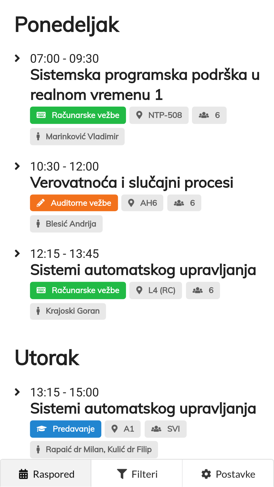
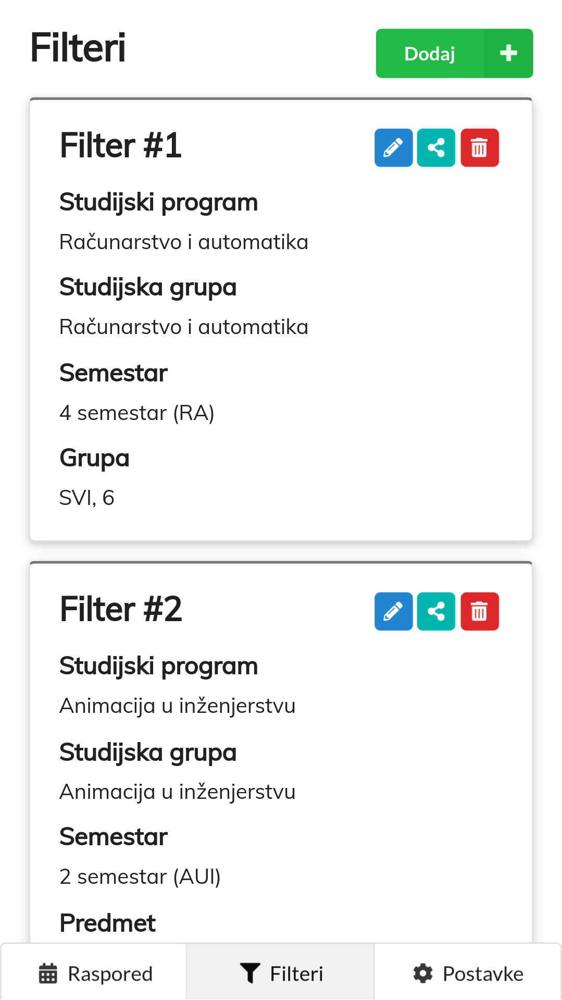
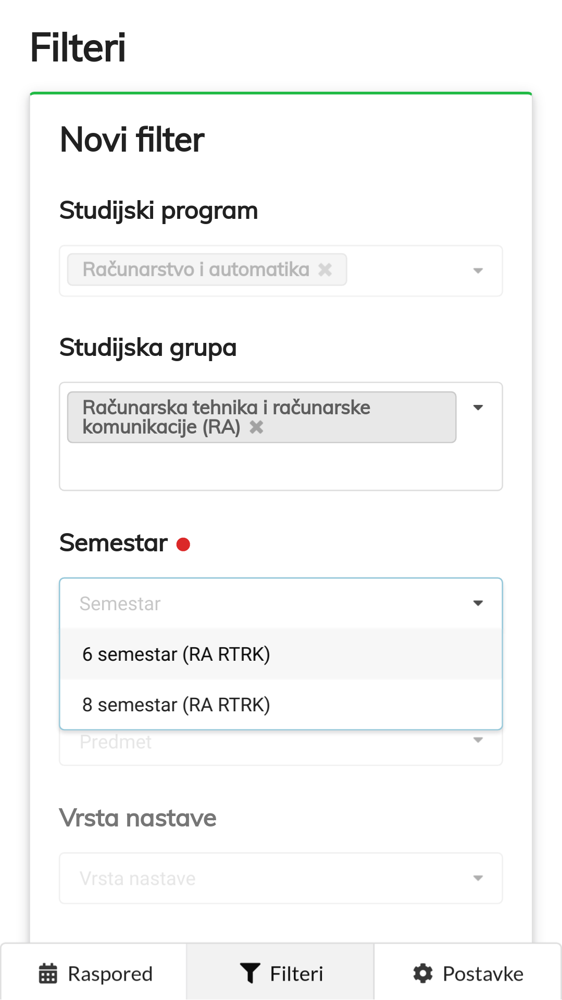
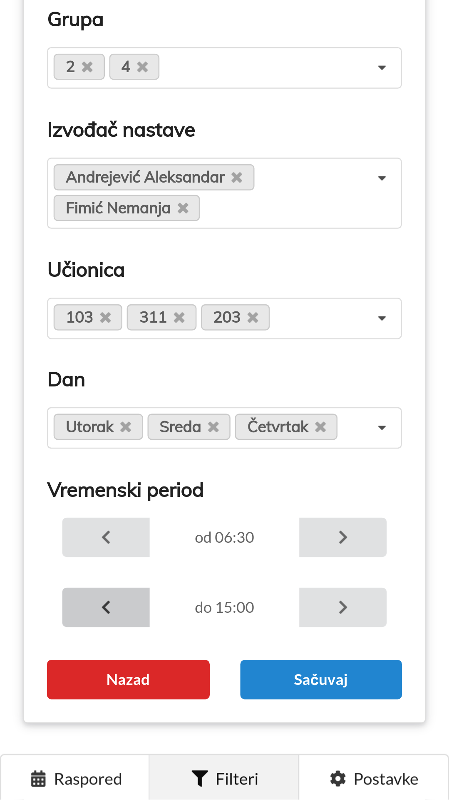
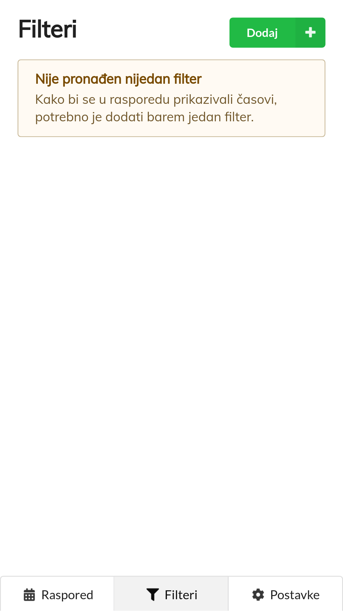
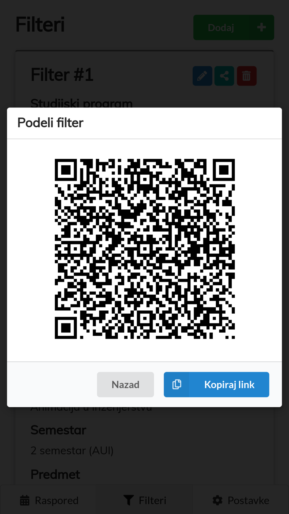
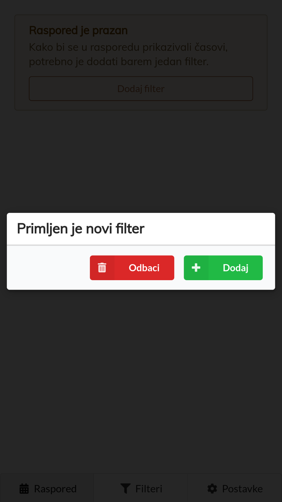
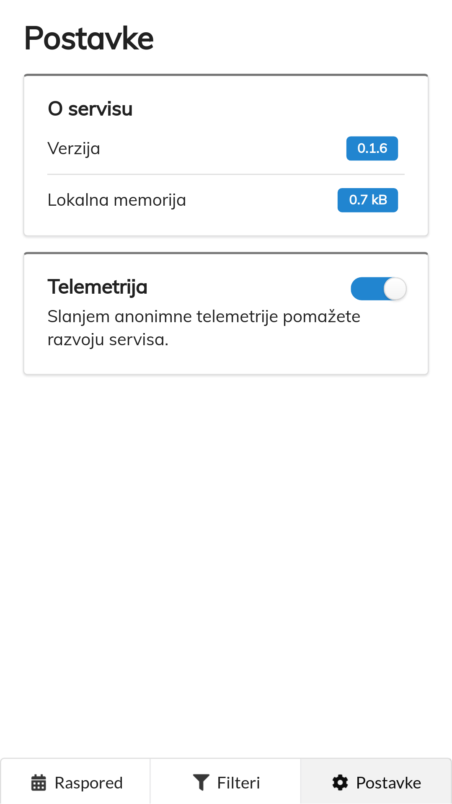

# FTN Raspored

Napredni raspored za Fakultet tehničkih nauka Univerziteta u Novom Sadu

## O projektu

Fakultetski raspored dolazi u vidu PDF dokumenta za svaki smer. Svi semestri, predmeti i grupe se nalaze u nepreglednim tabelama i studenti moraju sami da proveravaju da li je došlo do izmena rasporeda.

Ideja ovog servisa je da raspored nastave prikaže na što praktičniji i jednostavniji način, a da pri tome ne uskrati prikazivanje ni jednog važnog podatka it originalne tabele.

### Arhitektura servisa

Servis je izdeljen u tri celine: *backend*, *API* i *frontend*.
- *Backend* periodično preuzima zvanične PDF dokumente sa sajta fakulteta, parsira ih i podatke smešta u *SQLite* bazu podataka.
- *API* deo je takođe vrsta *backend*-a, ali kako samo čita iz baze i servira klijente, ovo mu je prilagodnije ime.
- *Frontend* je napravljen tako da mu se može pristupati kao web sajtu i mobilnoj aplikaciji (*Progressive Web App*).

### Prikazi ekrana

Raspored | Lista filtera | Novi filter | Izmena filtera
-- | -- | -- | --
  |  |  | 

 Bez filtera | Podeli filter | Primljen filter | Postavke
-- | -- | -- | --
  |  |  | 